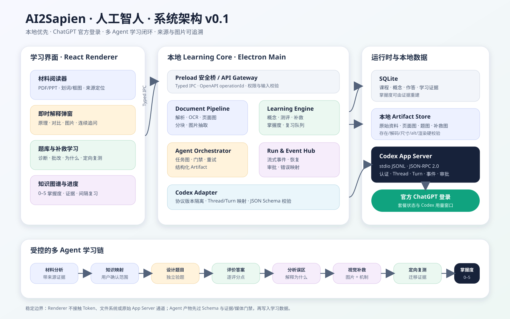
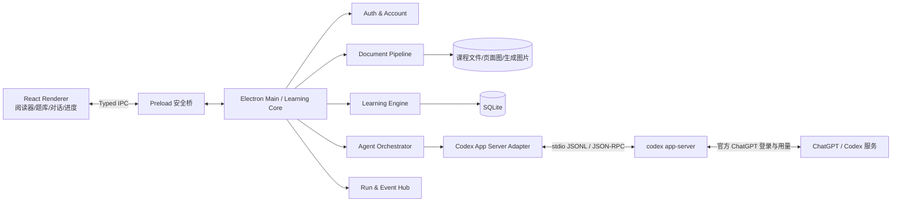
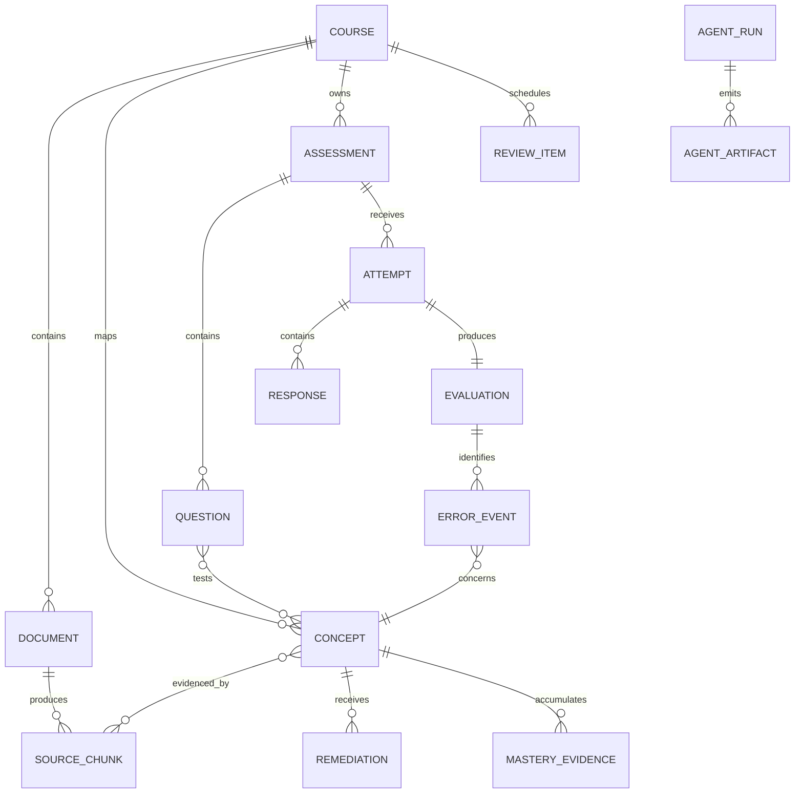
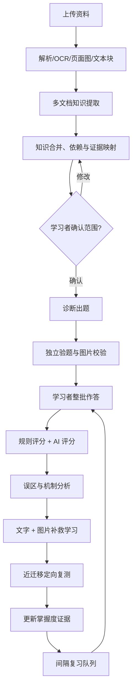

# AI2Sapien（人工智人）：系统架构 v0.1

状态：需求框架稿，供产品补充与技术评审，不代表已经开始业务开发。



如果当前 Markdown 预览不显示 SVG，可直接打开 [系统架构图 SVG](./自适应学习桌面端_系统架构_v0.1.svg)。

## 1. 产品定位

这是一个本地优先的自适应学习桌面应用。学习者上传自己的 PDF、PPTX、DOCX、Markdown 或图片资料，系统先建立可追溯的知识地图，再通过诊断、解释、图片辅助、补救练习、定向复测和间隔复习形成闭环。

AI 运行层采用 Codex App Server。每位用户通过官方 ChatGPT 登录流程登录自己的账号；应用不把 ChatGPT Plus 当作普通 API Key，也不读取或保存原始 ChatGPT Token。

首版目标：Windows 单用户桌面端。后续若要提供纯网页，需要另加一个本地伴随进程或服务端代理，不能让普通浏览器直接管理本地 `codex app-server` 进程。

## 2. 已确定的产品原则

1. **来源优先**：题目、答案、解释都能回到具体文档、页码/幻灯片和文本块。
2. **先诊断再教学**：不把所有内容平均讲一遍，只补当前薄弱点。
3. **解释机制，不只给答案**：批改必须说明错因、正确机制、相似概念区别和迁移条件。
4. **图片是学习内容，不是装饰**：需要时使用原图裁切、对比图、流程图、图表重绘；图片必须可见、带替代文本并经过发布前校验。
5. **出题与验题分离**：Question Designer 生成，Question Verifier 独立检查事实、歧义、答案泄露、评分点和图片。
6. **掌握度由证据驱动**：答对但理由错误不能记为完全掌握；跨情境与间隔后仍答对才进入高等级。
7. **应用业务层不依赖某个模型**：所有 AI 调用经过 `AgentRuntimePort`，当前适配 Codex App Server，未来可以增加其他运行时。
8. **用户拥有最终控制权**：知识地图可以确认/修改；涉及命令、文件变更、联网或外部工具时必须展示清楚的审批界面。

## 3. 技术边界与官方协议依据

Codex App Server 的官方定位就是把 Codex 深度嵌入产品，覆盖认证、历史、审批和流式 Agent 事件。首版采用以下稳定能力：

- 默认 `stdio://` 传输，使用逐行 JSON-RPC 2.0；WebSocket 当前为实验能力，不作为首版生产依赖。
- 连接后先执行 `initialize` / `initialized` 握手。
- 使用 `account/login/start` 完成 ChatGPT 浏览器登录或设备码登录，并监听账户状态变化。
- 使用 `thread/start`、`thread/resume`、`thread/fork` 管理角色会话。
- 使用 `turn/start` 发起任务，用 `outputSchema`约束单轮结构化结果。
- 使用 `item/*`、`turn/*` 通知实现流式 UI，用 `turn/interrupt` 取消运行。
- 使用 `account/rateLimits/read` 显示 ChatGPT/Codex 使用窗口。
- 正确处理 App Server 发起的命令、文件和权限审批请求。

开发时固定 Codex 版本，并在构建阶段运行：

```text
codex app-server generate-ts --out ./generated/codex-schema
codex app-server generate-json-schema --out ./generated/codex-schema
```

这能让适配层使用与实际安装版本完全一致的协议类型，而不是手写一份容易过期的副本。

官方参考：

- https://learn.chatgpt.com/docs/app-server
- https://learn.chatgpt.com/docs/pricing

## 4. 推荐形态

首版推荐 **Electron + React + TypeScript**：Electron 主进程可直接创建并监管 `codex app-server` 子进程，读取 JSONL、处理浏览器登录和本地文件；渲染进程只接触安全的 preload IPC 接口。

这不是永久绑定。领域服务只依赖端口接口，因此以后可以把壳替换为 Tauri，或把同一核心服务放入本地伴随进程供网页访问。



## 5. 模块边界

| 模块 | 职责 | 不负责 |
|---|---|---|
| Desktop Shell | 窗口、菜单、协议链接、更新、进程生命周期 | 学习规则 |
| Reader UI | 文档阅读、框选、划词、页码/坐标上下文、解释弹窗 | 直接调用 Codex |
| Learning Core | 用例编排、权限、事务、领域规则 | 模型供应商细节 |
| Auth & Account | 登录状态、登录流程、用量窗口的标准化 | 保存原始 Token |
| Document Pipeline | 文件指纹、解析、OCR、页面渲染、分块、图片抽取 | 生成最终题库 |
| Knowledge Service | 知识点、依赖、证据、用户确认 | 直接决定掌握度 |
| Assessment Service | 题集、作答、自动保存、提交、评分流程 | 在提交前暴露答案 |
| Remediation Service | 错因、机制讲解、视觉材料、近迁移题 | 重讲所有内容 |
| Mastery Service | 证据事件、掌握度快照、复习队列 | 修改原始作答 |
| Agent Orchestrator | 角色任务、并行/串行、门禁、重试、汇总 | 持有 UI 状态 |
| Codex Adapter | JSON-RPC、线程、事件、审批、错误映射 | 课程业务规则 |
| Artifact Store | 页面图、题目图、补救图、导出物 | 结构化领域记录 |

### 5.1 核心端口

核心层面向接口编程：

- `AgentRuntimePort`：启动/恢复会话、发起/取消 Run、流式事件、审批回复。
- `MaterialParserPort`：解析文档、OCR、页面预览和结构化块。
- `ArtifactStorePort`：保存/读取图片和其他二进制产物。
- `LearningRepositoryPort`：课程、概念、题目、作答、证据和掌握度。
- `ClockPort`：复习计划和可测试时间逻辑。
- `EventBusPort`：把后台 Run 事件发送给界面。

## 6. 领域对象



关键对象：

- `SourceChunk`：不可变的来源片段，保存文档版本、页码/幻灯片、字符位置和可选边界框。
- `Concept`：定义、前置知识、常见误区、来源证据和用户确认状态。
- `Question`：题干内容块、考查概念、能力层级、难度、答题规格、评分规则和媒体依赖。
- `Attempt`：一次不可覆盖的作答会话；草稿可更新，提交后冻结。
- `Evaluation`：得分、逐评分点判断、错因、置信度和证据。
- `MasteryEvidence`：只追加事件，例如诊断结果、近迁移结果、间隔复测结果。
- `MasterySnapshot`：由证据计算出的当前状态，可重建。
- `AgentRun`：一次后台 AI 工作，拥有状态、角色、线程和产物。
- `AgentArtifact`：所有 Agent 之间的标准交付物，见 `contracts/agent-artifact.schema.json`。

## 7. 主学习闭环



### 7.1 划词解释闭环

1. Reader 捕获所选文本、前后文、文档版本、页码和可选屏幕坐标。
2. Knowledge Service 查找已经存在的概念与来源；没有时创建候选概念。
3. Tutor Agent 按用户选择的模式回答：简明、原理、例子、对比、视觉解释。
4. 回复以流式事件进入弹窗；后续追问复用同一学习会话。
5. 用户可把解释保存为笔记、加入待复习、立即生成一题，或标记“仍不理解”。
6. “仍不理解”不会简单重复同一段话，而是切换表示方式并记录困难类型。

### 7.2 视觉补救规则

图像来源分为：

- `source_crop`：从原教材页/幻灯片裁切，必须绑定来源页与边界框。
- `generated_diagram`：为机制、关系或步骤生成的示意图，必须注明“AI 生成示意图”。
- `generated_chart`：由课程数据或题目数据重绘的图，必须保存数据与生成配置。

发布一道带图题或补救卡前，系统必须验证：

- 媒体文件存在、能解码、宽高大于零；
- 题目引用的 `artifactId` 有效；
- 有替代文本和可选说明文字；
- 图片本身没有泄露答案；
- 原图裁切可回到来源；生成图的文字与数字通过事实检查；
- 前端在当前题目布局中完成一次渲染探测，失败则阻止发布。

## 8. 多 Agent 编排

首版使用“应用管理的角色线程”，而不是完全依赖模型自行决定是否创建子 Agent。这样便于重放、审计、独立验题和限制用量。

| 角色 | 输入 | 输出 | 硬门禁 |
|---|---|---|---|
| `material_analyst` | 文档块/页面图 | 带证据的原子知识点 | 每条事实有来源 |
| `knowledge_mapper` | 各文档知识点 | 合并概念、依赖、别名 | 冲突不得静默合并 |
| `question_designer` | 已确认概念、难度蓝图 | 草稿题、评分规则、媒体需求 | 不接触学习者答案 |
| `question_verifier` | 草稿题、来源证据 | 验证报告与修订建议 | 未通过不能发布 |
| `answer_evaluator` | 冻结题目、评分规则、作答 | 逐评分点评价 | 必须解释扣分原因 |
| `misconception_analyst` | 评价、历史错误 | 错因模型与根因假设 | 区分失误与概念误区 |
| `remediation_tutor` | 错因、概念来源 | 原理讲解、例子、类比 | 必须回答“为什么” |
| `visual_designer` | 解释目标、证据/数据 | 图片规划或图像产物 | 必须带 alt text 和来源 |
| `retest_planner` | 当前薄弱点 | 近迁移/远迁移题 | 不复用原题表面形式 |
| `mastery_tracker` | 不可变学习证据 | 掌握度建议、复习时间 | 不直接改写原始记录 |
| `orchestrator` | 用例与策略 | 任务图、状态、汇总 | 不绕过任何硬门禁 |

### 8.1 并行策略

- 可并行：不同文档/周次的知识提取、不同题目的验证、多个互不依赖的图片校验。
- 必须串行：知识合并在提取之后；正式出题在范围确认之后；补救在评价之后；掌握度在证据写入之后。
- 低置信度开放题评分可启动第二个独立 Evaluator；分歧超过阈值时标记人工复核。
- 每个 Run 设置任务级超时和最多重试次数，不对已经成功且有幂等键的操作重复落库。

### 8.2 线程策略

- 每个课程拥有一个 Orchestrator Thread。
- 每个角色按“课程 + 角色 + 版本”维护可恢复 Thread；事实核验可用临时 Fork，避免污染长期上下文。
- `threadId` 只保存在运行时映射表中，业务对象引用自己的 `runId`/`artifactId`。
- Agent 之间只通过结构化 Artifact 交换，避免依赖聊天文本的隐含上下文。
- `turn/start.outputSchema` 使用与 Artifact 类型匹配的 JSON Schema。

## 9. 掌握度与错误模型

沿用已经验证过的 0–5 级模型：

| 等级 | 含义 | 最低证据 |
|---|---|---|
| 0 | 未接触 | 无 |
| 1 | 能识别 | 识别题正确 |
| 2 | 能解释 | 结论和关键机制正确 |
| 3 | 能应用 | 新例子或计算题正确 |
| 4 | 能迁移 | 不同表面情境连续正确 |
| 5 | 稳定掌握 | 间隔后仍能解释与迁移 |

建议错误标签：

- `definition_confusion`
- `boundary_condition_missed`
- `mechanism_missing`
- `representation_mismatch`
- `calculation_error`
- `chart_selection_error`
- `visual_reasoning_error`
- `causality_error`
- `metric_denominator_error`
- `ethical_risk_missed`
- `careless_slip`

掌握度更新必须是纯规则函数：`previous snapshot + new evidence -> new snapshot`。AI 可以生成证据标签和建议，但最终状态由可测试规则计算。

## 10. Run、事件与审批状态

### 10.1 Run 状态机

```text
queued -> running -> waiting_approval -> running -> succeeded
                  \-> failed
                  \-> cancelled
```

`waiting_approval` 不计作失败。应用重启后，未完成 Run 要么通过线程恢复继续，要么明确标为 `interrupted` 并允许用户重试。

### 10.2 事件类别

- `run.status.changed`
- `agent.message.delta`
- `artifact.created`
- `document.processing.progress`
- `assessment.ready`
- `evaluation.ready`
- `approval.required`
- `approval.resolved`
- `rate_limit.updated`
- `run.warning`
- `run.failed`

内部事件必须包含 `eventId`、`runId`、`sequence`、`occurredAt` 和负载。客户端使用 `Last-Event-ID` 或 IPC 游标恢复，不能仅靠内存拼接答案。

## 11. 数据与存储

建议本地目录结构：

```text
app-data/
  app.db
  courses/<courseId>/
    originals/
    pages/
    extracted-media/
    generated-media/
    exports/
  logs/
```

SQLite 表按以下边界拆分：

- 内容：`courses`, `documents`, `document_versions`, `source_chunks`, `concepts`, `concept_sources`, `concept_edges`。
- 学习：`assessments`, `questions`, `question_concepts`, `attempts`, `responses`, `evaluations`。
- 自适应：`error_events`, `remediations`, `mastery_evidence`, `mastery_snapshots`, `review_items`。
- 运行：`agent_runs`, `agent_artifacts`, `run_events`, `approvals`, `runtime_threads`。

原始文件只追加版本，不原地覆盖。删除课程属于破坏性操作，必须二次确认并给出导出选项。

## 12. 安全与隐私

- Renderer 开启 `contextIsolation`，关闭 `nodeIntegration`；只暴露白名单 IPC。
- `codex app-server` 仅由 Main Process 创建，首版使用 stdio；不开放公网端口。
- ChatGPT 登录凭证由 Codex 自身的认证机制管理；业务数据库只保存 `authMode`、`planType` 等非敏感状态快照。
- 模型上下文按需最小化：只发送当前任务相关的来源块、页图和历史摘要。
- 默认学习任务使用只读沙箱、禁用网络；确需联网或写文件时显示目的、路径/主机和持续范围。
- 审批不能在 Renderer 伪造：Main Process 为每个审批生成一次性 ID，并验证它仍属于活动 Run。
- 日志默认不记录原始题目答案、完整文档文本和认证信息；调试导出前先脱敏。
- 面向未成年人或公开分发时，需要另行完成隐私、内容安全、家长/学校授权与发行条款评审。

## 13. 失败恢复

| 故障 | 用户体验 | 系统动作 |
|---|---|---|
| 未安装 Codex | 引导安装/检测 | 不创建学习 Run |
| 登录过期 | 显示重新登录 | 保留本地学习数据 |
| 达到用量限制 | 显示窗口和重置时间 | 暂停新 Run，允许离线答题/复习 |
| App Server 崩溃 | 标记连接中断 | 指数退避重启并恢复可恢复线程 |
| 文档解析失败 | 指明页码/文件 | 允许重试、OCR 或手工标记 |
| AI 输出不合 Schema | 显示后台重试 | 最多一次修复轮，仍失败则保留原始 Run 供诊断 |
| 图片无法显示 | 阻止题目发布 | 重新生成/重新抽取并执行渲染探测 |
| 评分低置信度 | 标记待复核 | 启动独立复评或让用户确认 |

## 14. 首版开发切片

### Spike 0：Codex 可行性验证

1. 创建并监管 `codex app-server` stdio 进程。
2. 完成浏览器和设备码两种 ChatGPT 登录之一，读取 `planType`。
3. 读取并显示 rate limits。
4. `thread/start` + `turn/start`，渲染流式文本。
5. 取消 Run，处理至少一种审批请求。
6. 应用重启后 `thread/resume`。

### MVP 1：材料与划词学习

- 新建课程、上传 PDF/PPTX、页面阅读和文本选择。
- 来源分块、概念候选和用户确认。
- 解释弹窗、多轮追问、保存笔记、生成一道小题。

### MVP 2：诊断与补救闭环

- 诊断蓝图、带图题、整批提交。
- 客观题规则评分、开放题结构化评分、错因解释。
- 图片补救卡、定向复测、0–5 掌握度。

### MVP 3：复习与可视化

- 间隔复习队列、学习历史、知识图谱和掌握度视图。
- 课程导入/导出、失败恢复、可访问性检查。

## 15. 进入开发前需要产品补充的决定

以下问题不阻塞当前框架，但会影响 UI 和数据结构：

1. 首版只支持 Windows，还是同时支持 macOS？
2. 首版必须支持哪些文件格式和最大文件大小？
3. 题型范围：选择、判断、填空、简答、计算、图表诊断、拖拽是否都需要？
4. 用户能否编辑 AI 生成的知识点、答案、评分规则和图片？
5. 是个人学习工具，还是需要教师发布课程、多人班级和排行榜？
6. 是否需要完全离线解析/OCR？允许把哪些页面或文本发送给模型？
7. 掌握度规则和间隔复习算法是否需要用户可配置？
8. 是否需要中英双语、语音解释、手写/截图作答？
9. 导出格式：Markdown、PDF、Anki、CSV、学习报告分别是否需要？
10. 产品准备个人自用、私下分发还是公开商业发布？公开发布前需要单独核对条款、品牌和企业日志要求。

## 16. 验收定义

这个架构进入开发的最低条件：

- OpenAPI 与 Agent Artifact Schema 通过语法校验；
- 每个 MVP 用例都有明确入口、完成态、失败态和可恢复策略；
- 前端不能直接接触 ChatGPT 凭证、文件系统和 App Server 原始通道；
- 任意一道题都能追踪到知识点和资料证据；
- 任意带图题在发布前都经过文件、解码、alt text 和渲染校验；
- 评分结果能说明扣分原因和“为什么”，并能生成不同表面情境的复测题；
- Plus 用量只通过 App Server 的账户状态呈现，不承诺无限调用。
